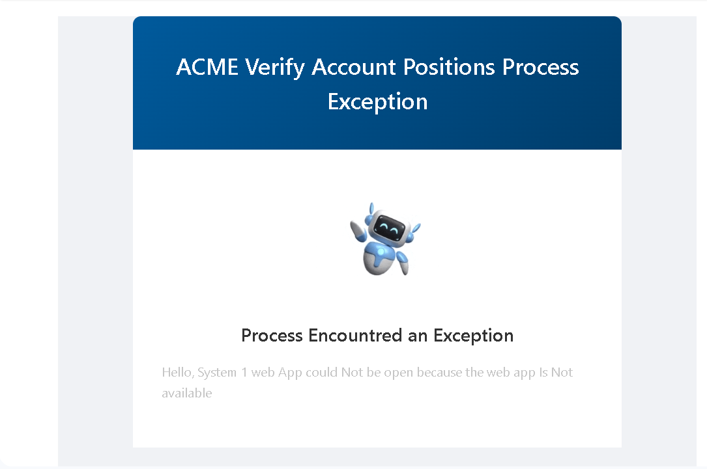
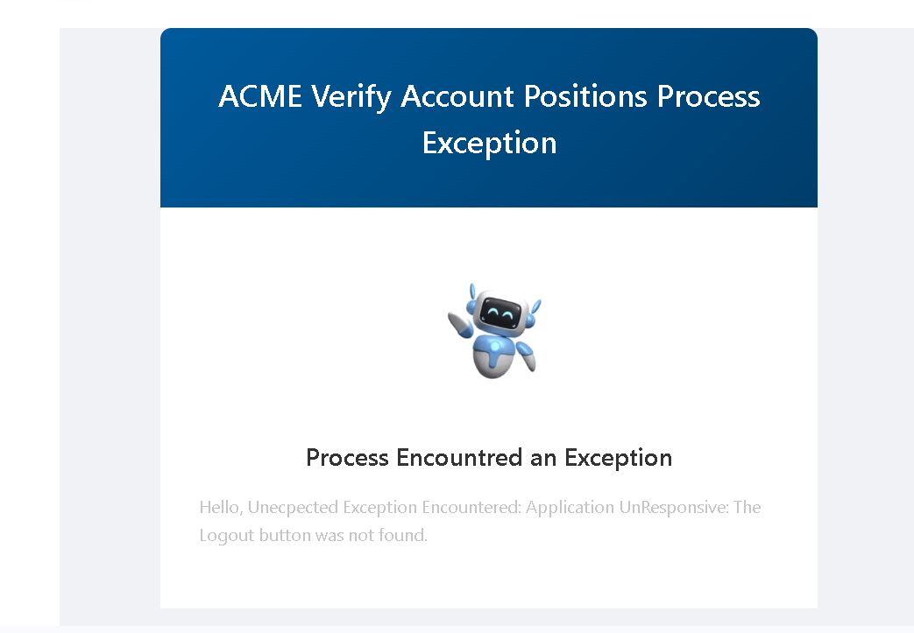

# Raya-RPA-Assessment-Task

---

## 1. Project Overview

This repository contains a complete UiPath RPA solution for the "Verify Account Positions" process, split into two main projects:

- **Dispatcher**: Extracts work items from the ACME web application and uploads them to Orchestrator queues.
- **Performer**: Processes the queued work items, automating both web and desktop interactions to verify account positions in ACME systems.

The solution is built on the UiPath Robotic Enterprise Framework (REFramework) for robust exception handling, logging, and scalability. It is designed for unattended execution on cloud-hosted virtual machines via UiPath Orchestrator.

---

## 2. Recordings & Images

All demonstration recordings and screenshots are located in the `Recordings` folder at the root of this repository. Preview below:

<p align="center">
	
	
</p>

<p align="center">
	
	
</p>


---

## 3. Project Structures

### Dispatcher Structure

```
RAYA_UiPath_VerifyAccountPositions_Dispatcher/
├── ACMEWeb/
│   ├── ACMEWeb_ExtractWorkItems.xaml
│   ├── ACMEWeb_InitializeApp.xaml
│   ├── ACMEWeb_Login.xaml
│   └── ACMEWeb_NavigateWorkItems.xaml
├── Common/
│   ├── Control/
│   │   ├── Common_CheckAppCrash.xaml
│   │   └── Common_CloseApp.xaml
│   └── Email/
│       └── Email_SendExceptionMail.xaml
├── Data/
│   ├── Config.xlsx
│   ├── Input/
│   │   ├── EmailTemplate.html
│   │   └── placeholder.txt
│   ├── Output/
│   │   └── placeholder.txt
│   └── Temp/
│       └── placeholder.txt
├── Dispatcher/
│   └── Dispatcher_DispatchWorkItems.xaml
├── Documentation/
│   └── REFramework Documentation-EN.pdf
├── Exceptions_Screenshots/
│   ├── ExceptionScreenshot_251001.030834.png
│   ├── ExceptionScreenshot_251001.044032.png
│   ├── ExceptionScreenshot_251001.044711.png
│   ├── ExceptionScreenshot_251001.110127.png
│   ├── ExceptionScreenshot_251001.111102.png
│   ├── ExceptionScreenshot_251001.124209.png
│   ├── ExceptionScreenshot_251001.124932.png
│   └── placeholder.txt
├── Framework/
│   ├── CloseAllApplications.xaml
│   ├── ExtractAndUploadQueueItems.xaml
│   ├── InitAllApplications.xaml
│   ├── InitAllSettings.xaml
│   ├── KillAllProcesses.xaml
│   ├── RetryCurrentTransaction.xaml
│   ├── SetTransactionStatus.xaml
│   └── TakeScreenshot.xaml
├── Tests/
│   ├── InitAllApplicationsTestCase.xaml
│   ├── InitAllSettingsTestCase.xaml
│   ├── MainTestCase.xaml
│   ├── ProcessTestCase.xaml
│   ├── Tests.xlsx
│   └── WorkflowTestCaseTemplate.xaml
├── LICENSE
├── Main.xaml
├── Main.xaml.json
├── project.json
└── README.md
```

### Performer Structure

```
RAYA_UiPath_VerifyAccountPositions_Performer/
├── ACMEDesktop/
│   ├── ACMEDesktop_InitializeApp.xaml
│   ├── ACMEDesktop_Login.xaml
│   ├── ACMEDesktop_NavigateToAccountTransactions.xaml
│   ├── ACMEDesktop_NavigateToClientAccounts.xaml
│   ├── ACMEDesktop_NavigateToClientDetails.xaml
│   ├── ACMEDesktop_NavigateToClientSearch.xaml
│   ├── ACMEDesktop_SumAccountTransactions.xaml
│   └── Control/
│       └── ACMEDesktop_ControlTabs.xaml
├── ACMEWeb/
│   ├── ACMEWeb_ExtractWorkItemData.xaml
│   ├── ACMEWeb_InitializeApp.xaml
│   ├── ACMEWeb_Login.xaml
│   ├── ACMEWeb_NavigateToUpdateWorkItem.xaml
│   ├── ACMEWeb_NavigateWorkItems.xaml
│   └── ACMEWeb_UpdateWorkItem.xaml
├── Common/
│   ├── Control/
│   │   ├── Common_CheckAppCrash.xaml
│   │   ├── Common_CloseApp.xaml
│   │   └── Control_CheckAccountPosition.xaml
│   └── Email/
│       └── Email_SendExceptionMail.xaml
├── Data/
│   ├── Config.xlsx
│   ├── Input/
│   │   ├── EmailTemplate.html
│   │   └── placeholder.txt
│   ├── Output/
│   │   └── placeholder.txt
│   └── Temp/
│       └── placeholder.txt
├── Documentation/
│   └── REFramework Documentation-EN.pdf
├── Email/
│   └── Email_SendExceptionMail.xaml
├── Exceptions_Screenshots/
│   └── placeholder.txt
├── Framework/
│   ├── CloseAllApplications.xaml
│   ├── GetTransactionData.xaml
│   ├── InitAllApplications.xaml
│   ├── InitAllSettings.xaml
│   ├── KillAllProcesses.xaml
│   ├── Process.xaml
│   ├── RetryCurrentTransaction.xaml
│   ├── SetTransactionStatus.xaml
│   └── TakeScreenshot.xaml
├── Tests/
│   ├── GetTransactionDataTestCase.xaml
│   ├── InitAllApplicationsTestCase.xaml
│   ├── InitAllSettingsTestCase.xaml
│   ├── MainTestCase.xaml
│   ├── ProcessTestCase.xaml
│   ├── Tests.xlsx
│   └── WorkflowTestCaseTemplate.xaml
├── LICENSE
├── Main.xaml
├── Main.xaml.json
├── project.json
└── README.md
```

## 4. Key Features & Functions

- End-to-end automation of the "Verify Account Positions" process using UiPath REFramework
- Dispatcher extracts work items from ACME web and uploads to Orchestrator queue
- Performer processes queue items, automating both web and desktop ACME systems
- Robust exception handling and logging (screenshots on error)
- Modular workflows for easy maintenance and scalability
- Designed for unattended execution on cloud VMs via Orchestrator
- Test cases and templates included for validation

---

## 5. Assets Used (Dispatcher & Performer)

Both projects use the following assets (to be configured in UiPath Orchestrator):

| Asset Name                | Type        |
|--------------------------|-------------|
| ACME_Credential           | Credential  |
| DataFolderPath            | Text        |
| ExceptionMail_Reciever    | Text        |
| ExceptionMail_Subject     | Text        |
| Mail_PortNumber           | Text        |
| Mail_Server               | Text        |
| ScreenshotsFolderPath     | Text        |
| SenderMail_Credential     | Credential  |
| System1_URL               | Text        |
| WI_Type                   | Text        |


---

## 6. Cloud Orchestrator & Unattended VMs

This solution is published to UiPath Cloud Orchestrator and configured to run on unattended virtual machines. This enables fully automated, scheduled, and scalable execution without human intervention.

---

## 7. Required Configuration

Before running the process, ensure the following prerequisites are met:

1. **Microsoft Edge browser** is installed
2. **UiPath extension for Edge** is activated (including for private windows)
3. **ACME System 3** is installed and accessible

---

## 8. Packages Used

Both Dispatcher and Performer use the following UiPath packages:

| Package Name                  | Version    |
|-------------------------------|------------|
| UiPath.Excel.Activities       | 3.2.1      |
| UiPath.Mail.Activities        | 2.4.10     |
| UiPath.System.Activities      | 25.10.0    |
| UiPath.Testing.Activities     | 25.10.0    |
| UiPath.UIAutomation.Activities| 25.10.16   |

---
